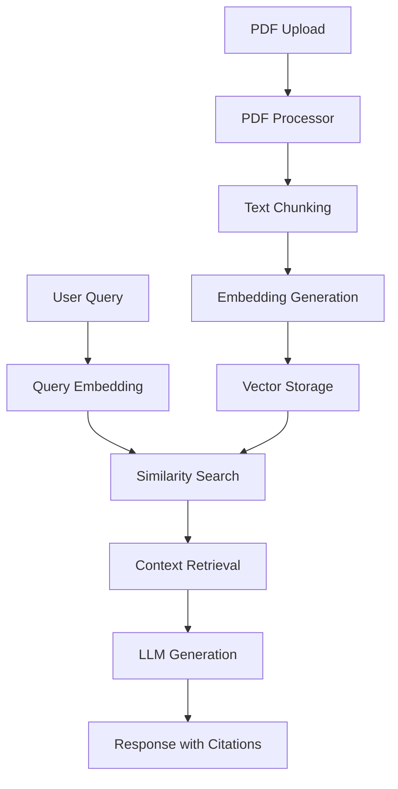

# Askly: Chatbot RAG cho tài liệu PDF

Askly là một hệ thống chatbot RAG (Retrieval-Augmented Generation) hiện đại cho phép người dùng "trò chuyện" với các tài liệu PDF bằng tiếng Việt. Dự án cung cấp giao diện web đẹp mắt với khả năng tải lên PDF, quản lý tài liệu và trò chuyện thông minh dựa trên nội dung tài liệu.

## Tính năng chính

### Giao diện người dùng hiện đại
- **Giao diện web Flask**: UI hiện đại với thiết kế responsive
- **Streamlit Interface**: Giao diện đơn giản cho demo nhanh
- **Gradio Interface**: Giao diện chatbot truyền thống
- **Drag & Drop Upload**: Tải lên PDF dễ dàng với thanh tiến trình
- **Quản lý tài liệu**: Xem, xóa và quản lý các PDF đã tải lên

### Khả năng RAG thông minh
- **Xử lý PDF tiếng Việt**: Hỗ trợ đầy đủ văn bản tiếng Việt
- **Truy xuất ngữ cảnh**: Tìm kiếm thông tin liên quan từ tài liệu
- **Trích dẫn nguồn**: Hiển thị nguồn thông tin trong câu trả lời
- **Lịch sử trò chuyện**: Lưu trữ và hiển thị cuộc hội thoại
- **Cập nhật tăng dần**: Thêm tài liệu mới mà không cần xử lý lại toàn bộ

### Kiến trúc linh hoạt
- **Modular Design**: Kiến trúc module hóa dễ bảo trì
- **Multi-LLM Support**: Hỗ trợ nhiều mô hình LLM (Gemini API, Local models)
- **Vector Database**: Lưu trữ và truy xuất embedding hiệu quả
- **CUDA Support**: Tăng tốc GPU cho xử lý embedding
- **Persistent Storage**: Lưu trữ dữ liệu và khôi phục nhanh chóng

## Kiến trúc hệ thống



### Luồng xử lý RAG:
1. **Ingestion**: Tải lên và xử lý PDF thành các đoạn văn bản
2. **Embedding**: Chuyển đổi văn bản thành vector embeddings
3. **Storage**: Lưu trữ embeddings và metadata vào vector database
4. **Retrieval**: Tìm kiếm các đoạn văn bản liên quan đến câu hỏi
5. **Generation**: Tạo câu trả lời dựa trên ngữ cảnh được truy xuất

## Yêu cầu hệ thống

- **Python**: 3.9 hoặc cao hơn
- **RAM**: Tối thiểu 8GB (khuyến nghị 16GB)
- **GPU**: Tùy chọn (CUDA support cho tăng tốc)
- **Disk**: 2GB trống cho dependencies và data

## Hướng dẫn cài đặt

### 1. Clone repository
```bash
git clone <repository-url>
cd Askly
```

### 2. Tạo môi trường ảo
```bash
python -m venv venv

# Windows
.\venv\Scripts\activate

# macOS/Linux
source venv/bin/activate
```

### 3. Cài đặt dependencies
```bash
pip install -r requirements.txt
```

### 4. Cấu hình API Key (Tùy chọn)
Tạo file `.env` trong thư mục gốc:
```env
GEMINI_API_KEY=your_gemini_api_key_here
```

Hoặc cấu hình trong `config/config.py`:
```python
API_KEY = "YOUR_GEMINI_API_KEY"
```

## Cách sử dụng

### Giao diện Web (Khuyến nghị)
Giao diện hiện đại với đầy đủ tính năng:
```bash
python web_app.py
```
Truy cập: `http://localhost:5000`

### Giao diện Streamlit
Giao diện đơn giản cho demo:
```bash
streamlit run app.py
```
Truy cập: `http://localhost:8501`

### Giao diện Gradio
Giao diện chatbot truyền thống:
```bash
python gradio_app.py
```
Truy cập: `http://localhost:7860`

### Demo giao diện (Không RAG)
Để test UI mà không cần xử lý RAG:
```bash
python web_demo.py
```

## Cấu trúc dự án

```
Askly/
├── Giao diện người dùng
│   ├── web_app.py              # Flask web application (main)
│   ├── web_demo.py             # Demo UI without RAG
│   ├── app.py                  # Streamlit interface
│   └── gradio_app.py           # Gradio interface
│
├── Core RAG System
│   ├── rag_pipeline.py         # Main RAG pipeline
│   ├── build_embeddings.py     # Embedding generation
│   └── process_latest_pdf.py   # Incremental PDF processing
│
├── Components
│   ├── config/                 # Configuration files
│   │   ├── config.py          # Main configuration
│   │   └── __init__.py
│   ├── processors/             # PDF and text processing
│   │   ├── pdf_processor.py   # PDF extraction
│   │   ├── text_processor.py  # Text chunking and cleaning
│   │   └── __init__.py
│   ├── models/                 # LLM and embedding models
│   │   ├── embedding_model.py # Embedding generation
│   │   ├── llm_model.py       # LLM interface
│   │   ├── retrieval_model.py # Vector search
│   │   └── __init__.py
│   └── utils/                  # Utility functions
│       ├── file_utils.py      # File operations
│       ├── text_utils.py      # Text processing utilities
│       └── __init__.py
│
├── Frontend Assets
│   ├── templates/              # HTML templates
│   │   └── index.html         # Main web interface
│   └── static/                # CSS, JS, images
│       ├── css/style.css      # Modern styling
│       └── js/app.js          # Interactive features
│
├── Data & Storage
│   ├── data/                   # PDF uploads and embeddings
│   │   ├── uploaded_pdfs/     # Uploaded PDF files
│   │   ├── embeddings/        # Vector embeddings
│   │   └── processed/         # Processed text chunks
│   └── outputs/               # Generated outputs
│
├── Testing & Utils
│   ├── test_incremental.py    # Incremental testing
│   ├── main.py                # Main entry point
│   └── run_rag.py             # RAG testing script
│
└── Documentation
    ├── README.md              # This file
    ├── requirements.txt       # Python dependencies
    ├── .env                   # Environment variables
    └── .gitignore            # Git ignore rules